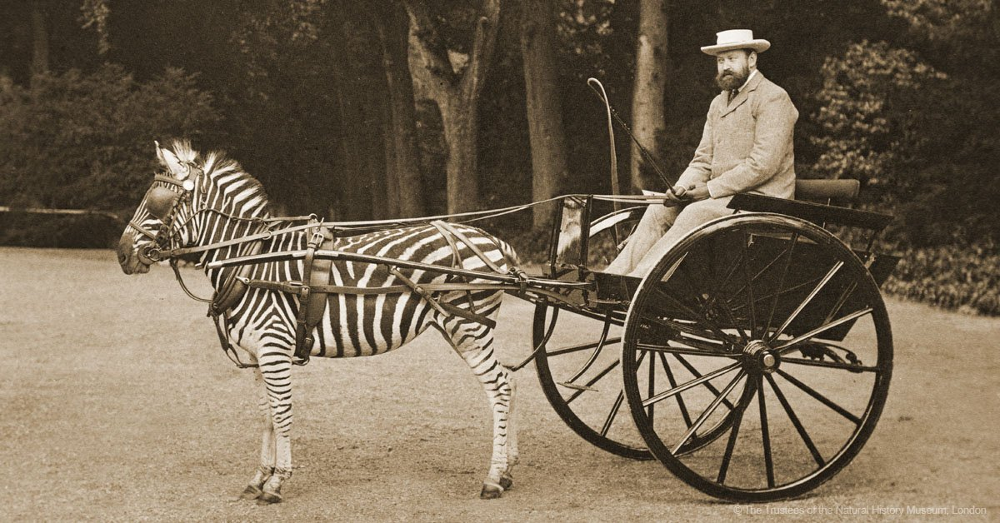

Available workflows
===================

1. The [maximum entropy](1_maxent.rmd) workflow performs species distribution 
   modeling using MaxEnt. The modeling is performed on the data sets in 
   `/data/filtered`, and the results are written in `/results/per_species`. For 
   valid (accurate) models, the habitat suitability projection is written to a 
   map, including a version with the input occurrences. In addition, the variable 
   importance and the response to each variable is plotted.
2. The [outlying mean index](2_omi.rmd) workflow computes 'trait' values for each
   species and for each GIS layer. The values are obtained either by taking the
   GIS layers directly under the raw occurrences and by taking values averaged
   over the GIS layer pixels whose habitat suitability is higher than that of
   the worst 10% of the raw occurrences. Subsequently the Gower's distance 
   between species is computed for these values, and the species are then 
   clustered.
3. The [niche clusters](3_niche_clusters.rmd) workflow
2. The [phylogeny](2_phylogeny.rmd) workflow tests whether evolutionary 
   relatedness, i.e. phylogeny, shapes the pattern of similarities and 
   differences in abiotic niche dimensions among the terrestrial Ungulates. The 
   general approach to test this is to perform a Mantel test that randomizes
   niche clustering a predefined number of times (e.g. 100) with respect to the
   phylogenetic clustering, and then assesses the distribution of correlation
   coefficients.

Manuscript
----------

Apart from the notes being collected here, we are also preparing an 
[overleaf manuscript](https://www.overleaf.com/project/5c7cfef8ac6a080f4fd4476a)
