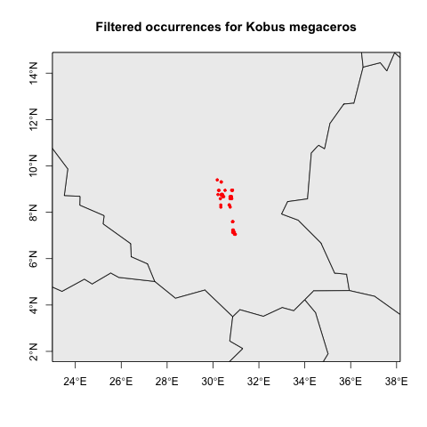
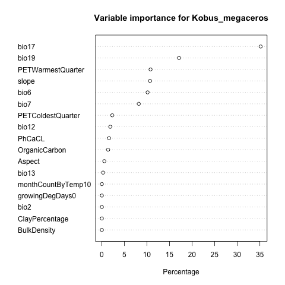
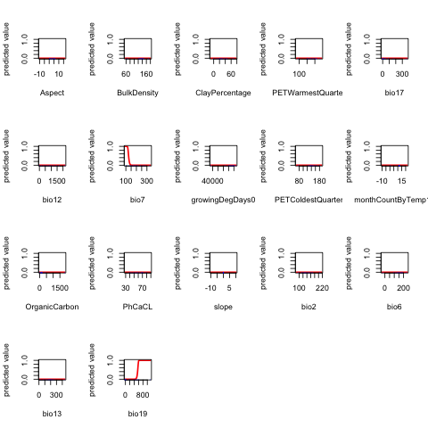
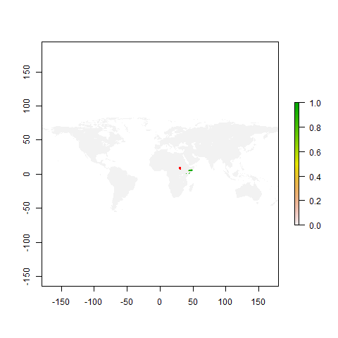

# Kobus megaceros 

## Distribution of occurrence points 

The following map shows the distribution of the filtered 
[occurrences](../../data/filtered/Kobus megaceros.csv) for Kobus megaceros used in 
[the Maxent model](valid_maxent_model.rda). 

    
## Variable importance 

The variable importance graph shows the relative importance of the abiotic 
raster layers in the model

    
## Response curves

The response curve graphs show the modeled response of Kobus megaceros to the 
selected abiotic raster layers. 

    
## Model predictions

To be able to compute the potential distribution overlap, worldwide, between
all pairs of species, a model [prediction](valid_maxent_prediction.Rda) is
available. However, for prediction maps that take into account large-scale 
biogeographic barriers to dispersal, we use a 
[restricted prediction](valid_maxent_prediction_restricted.rda) that limits 
the projection to the 
[zoogeographical realm(s)](../../data/GIS/Realms/newRealms.shp) in which the
raw occurrences are located. The maps below are based on this restricted
projection.

The first map shows the predicted suitable areas on earth based on the niche 
preferences for Kobus megaceros calculated in the Maxent model. The second map 
shows the suitable area map with the original occurrence points superimposed.

    
